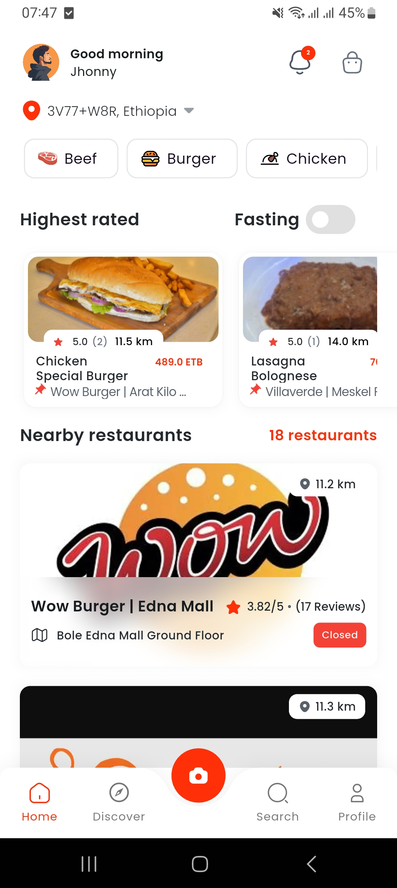
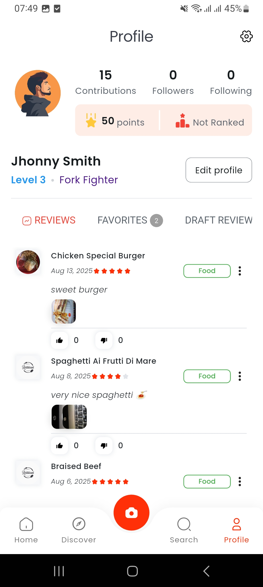
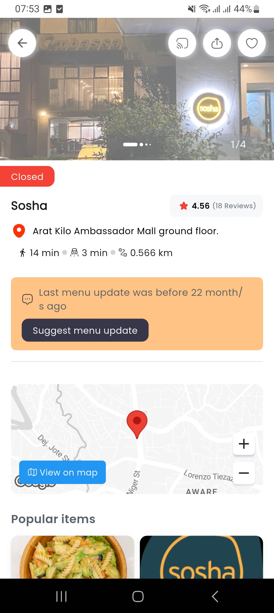
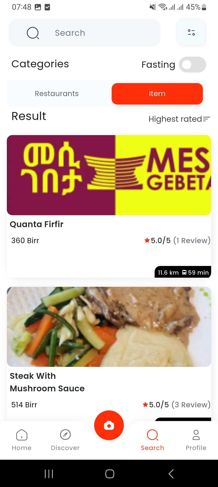

# RateEat Mobile 

RateEat is a comprehensive mobile application designed to help users discover, rate, and review restaurants and dishes. Find the best eats around you, share your culinary experiences, and connect with a community of food lovers.

---

## 📑 Table of Contents
- [🚀 Features](#-features)
- [🛠️ Tech Stack](#️-tech-stack)
- [📋 Getting Started](#-getting-started)
  - [Prerequisites](#prerequisites)
  - [Installation](#installation)
- [🧪 Testing](#-testing)
- [🔧 Development](#-development)
- [🚀 CI/CD with Codemagic](#-cicd-with-codemagic)
- [📱 Supported Platforms](#-supported-platforms)
- [🖼️ Screenshots](#-screenshots)
- [🤝 Contributing](#-contributing)
- [📞 Support](#-support)
- [🙏 Acknowledgments](#-acknowledgments)

---

## 🚀 Features

- **Discover Restaurants**: Search for restaurants by name, location, or cuisine using Google Maps integration
- **Rate & Review**: Share your opinion by rating restaurants and specific dishes on a 5-star scale
- **Photo & Video Sharing**: Upload photos and videos of your meals to accompany your reviews
- **User Profiles**: Create a profile to track your reviews and favorite spots
- **Personalized Recommendations**: Get suggestions based on your rating history and preferences
- **Social Features**: Connect with other food enthusiasts and share experiences
- **Real-time Notifications**: Stay updated with Firebase messaging
- **Offline Support**: Access your data even when offline with local storage
- **Multi-language Support**: Internationalization support for multiple languages
- **Social Authentication**: Sign in with Google 

---

## 🛠️ Tech Stack

- **Framework**: Flutter 3.24.3 ([Manage versions with FVM](https://fvm.app/))
- **Language**: Dart 3.1.2+
- **State Management**: BLoC Pattern with flutter_bloc
- **Backend Integration**: RESTful APIs with Dio
- **Authentication**: Firebase Auth, Google Sign-In
- **Maps**: Google Maps Flutter
- **Local Storage**: Hive Database
- **Image Handling**: Image Picker, Cached Network Image
- **Push Notifications**: Firebase Messaging
- **Analytics**: Firebase Analytics & Crashlytics
- **Performance**: Firebase Performance Monitoring
- **Video**: Video Player, Video Thumbnail
- **UI Components**: Custom icons, animations, responsive design

---

## 📋 Getting Started

Follow these instructions to get a copy of the project up and running on your local machine for development and testing purposes.  
> **Note:** Ensure you have the necessary permissions to clone this private repository.

### Prerequisites

- [Flutter SDK](https://flutter.dev/docs/get-started/install) (version 3.1.2 or higher)
- [Android Studio](https://developer.android.com/studio) or [VS Code](https://code.visualstudio.com/)
- [Xcode](https://developer.apple.com/xcode/) (for iOS development)
- [CocoaPods](https://cocoapods.org/) (for iOS dependencies)

---

### Installation

1. **Clone the repository**
   ```bash
   git clone https://github.com/A2SV/RateEat.git
   cd RateEat/rateeat_mobile
   ```

2. **Install Flutter dependencies**
   ```bash
   flutter pub get
   ```

3. **Install iOS dependencies** (iOS only)
   ```bash
   cd ios && pod install && cd ..
   ```

4. **Set up environment variables and signing files**

   - Create a `.env` file in the root directory with your API keys:
     ```env
     BASE_URL="backend_url"
     API_KEY="api_key"
     GOOGLE_API_KEY="google_maps_api_key"
     ```

   - Create a `key.properties` file inside the `android` folder:
     ```properties
     storePassword=store_password
     keyPassword=key_password
     keyAlias=key_alias
     storeFile=keystore_filename.jks
     ```

   - Place your `mykey.jks` file inside the `android/app` folder.

5. **Run the application**
   ```bash
   # For development
   flutter run

   # For specific platform
   flutter run -d android
   flutter run -d ios
   ```

---

## 🧪 Testing

Run the test suite to ensure everything is working correctly:

```bash
# Run all tests
flutter test

# Run tests with coverage
flutter test --coverage

# Run integration tests
flutter drive --target=test_driver/app.dart
```

### 🔍 Testing Guide for Beginners:
- **`flutter test`**: Runs all unit tests to verify app logic.
- **`flutter test --coverage`**: Runs tests and generates a coverage report showing how much of the code is tested.
- **`flutter drive --target=...`**: Executes integration tests, simulating real user interactions on devices or emulators.

---

## 🔧 Development

### Code Quality

This project follows Flutter best practices and includes:

- **Linting**: Configured with `flutter_lints` for code quality
- **Code Analysis**: Run `flutter analyze` to check for issues
- **Formatting**: Use `flutter format .` to format code consistently

### Architecture

The app follows a clean architecture pattern with:

- **Presentation Layer**: UI components and BLoC state management
- **Domain Layer**: Business logic and entities
- **Data Layer**: Repository pattern with local and remote data sources

### Build Variants

- **Debug**: Development build with debugging enabled
- **Release**: Production build optimized for performance

---

## 🚀 CI/CD with Codemagic

This project includes a comprehensive CI/CD pipeline using Codemagic with three workflows:

### Workflows

1. **Development**: Triggered on `develop` and `feature/*` branches
   - Runs tests and analysis
   - Builds debug APK and iOS app
   - Sends failure notifications

2. **Production**: Triggered on `main` and `release/*` branches
   - Runs full test suite
   - Builds release AAB and IPA
   - Publishes to Google Play (internal track) and TestFlight
   - Sends success/failure notifications

3. **Testing**: Triggered on pull requests
   - Runs tests with coverage
   - Performs code analysis and formatting checks
   - Generates coverage reports

---

### Setup Instructions

1. **Connect your repository** to Codemagic
2. **Configure environment variables** in Codemagic dashboard:
   - `BASE_URL`, `API_KEY`, `GOOGLE_API_KEY`
   - Firebase configuration files (base64 encoded)
   - Signing certificates and keys
   - App Store Connect credentials

3. **Set up signing**:
   - Android: Upload your keystore and configure signing
   - iOS: Configure certificates and provisioning profiles

---

### 📱 Supported Platforms

- ✅ Android (minSdkVersion 21+, targetSdkVersion 35)
- ✅ iOS (iOS 14.0+)

---

### 🖼️ Screenshots


| 🏠 Home Page | 👤 Profile Page |
|-------------|----------------|
|  |  |

| 🍽️ Restaurants Detail | 🔍 Search Item |
|----------------------|---------------|
|  |  |

---

## 🤝 Contributing

1. Fork the repository
2. Create a feature branch (`git checkout -b feature/amazing-feature`)
3. Commit your changes (`git commit -m 'Add some amazing feature'`)
4. Push to the branch (`git push origin feature/amazing-feature`)
5. Open a Pull Request

---

## 📞 Support

For support and questions:
- Create an issue in this repository
- Contact the development team
- Check the [Flutter documentation](https://flutter.dev/docs)

---

## 🙏 Acknowledgments

- Flutter team for the amazing framework
- Firebase for backend services
- Google Maps for location services
- All contributors and testers